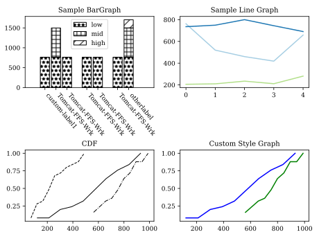

`progbg`
========
The **Prog**rammable **B**enchmarker and **G**raphing Tool

Identifying bottlenecks and problems within a system is essential when
developing systems. Being able to quickly produce simple graphs helps see these
bottlenecks more clearly as well as possibly see degenerative issues within a
system, with API's like matplotlib often exposing much more than is needed for
99% of graphs.

`progbg` is a simple framework that exposes a planning API to allow you to plan execution of
your benchmarks through the registering of workloads and backends. Data produced by these classes are parsed to produce data that can be used by graphs and figures. 
`progbg` utilizes [`matplotlib`](https://matplotlib.org) for its graphing library.

`progbg` exposes an object oriented API which allows users to place objects into executions, these executions expose data defined by the user during the parsing of that execution.
Users than wrap these executions in Bars or Lines and place them onto a graph to quickly produce graphs.

More information and docs can be found [here](https://krhancoc.github.io/progbg/)





Installation
------------
`progbg` can be installed through pip

```sh
$ pip install progbg
```

Example
---------------
Take a look at a working [example](tests/plan.py) plan.  Try running it with the command
`progbg plan.py -p 8080` and go to `localhost:8080` to view the example graphs!


Viewing Graphs
------------
Graphs are saved by default in the `graphs` directory of the current working directory.

By passing the argument `-p PORT` to `progbg`, this will expose figures and graphs to be viewed by your browser
at `http://localhost:PORT`

Author
------
Kenneth R Hancock `krhancoc <https://github.com/krhancoc>`

Note From The Author
-------------------
`progbg` is currently still in early points of development and is subject to large changes. I use it personally for my academic
work, and often idea's on its API comes through iteration during the paper writing process.

Paper's that used `progbg`
---------------------

* [The Aurora Operating System: Revisiting the Single Level Store](https://sigops.org/s/conferences/hotos/2021/) - **HotOS 18, 2021**
